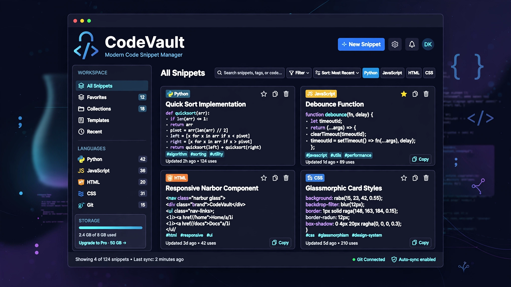

  

<h1 align="center">🔐 CodeVault</h1>

  A modern, mobile-first code snippet manager for saving, organizing, searching, and managing useful code.

  
  
  
  

⸻

📌 Overview

CodeVault is a modern, mobile-first code snippet manager built with HTML, CSS, and JavaScript.

It provides developers with a simple personal library for saving, organizing, searching, filtering, favoriting, copying, sorting, and deleting useful code snippets directly from the browser.

The current version is completely frontend-based and does not require a backend or database.

⸻

✨ Features

📦 Snippet Management

* 📦 Add and save code snippets
* ⭐ Favorite snippets
* 🗑️ Delete snippets
* 📋 Copy code to clipboard

🔎 Organization

* 🔎 Search snippets
* 🏷️ Filter by programming language
* ↕️ Sort by newest
* ↕️ Sort by oldest
* 🔤 Sort by name

🎨 Interface

* 🌙 Dark mode
* 📱 Mobile-first responsive design
* ⚡ Fast browser-based interactions
* 💾 Persistent local data

🏗️ Architecture

* No backend required
* No database required
* Runs directly in the browser
* LocalStorage-based persistence

⸻

🛠️ Technologies

Technology	Purpose
HTML5	Application structure
CSS3	Styling and responsive UI
JavaScript ES6+	Application logic and interactions
LocalStorage API	Persistent snippet storage
Clipboard API	Copying code
Google Fonts	Application typography
Inter	Interface font
JetBrains Mono	Code/snippet font

⸻

📂 Project Structure

CodeVault/
│
├── assets/
│   └── codevault-banner.png
│
├── index.html
├── style.css
├── script.js
├── README.md
└── .gitignore

⸻

🚀 Getting Started

CodeVault does not require installation or a backend server.

1. Clone the repository

git clone https://github.com/Yassir050/CodeVault.git

2. Open the project

Open:

index.html

in a modern web browser.

For development, the project can also be opened using a local development server such as VS Code Live Server.

⸻

💾 Data Storage

The current version uses the browser’s:

localStorage

to save code snippets and application data.

This means your snippets are stored locally on the device and browser being used.

⚠️ Important

LocalStorage is browser-specific.

Clearing the browser’s site data can permanently remove locally stored snippets.

The current version does not provide cloud backup or synchronization.

⸻

🔎 How It Works

📦 Save a Snippet

Users can create a new snippet and save useful code directly inside CodeVault.

🔎 Search

The search system allows users to quickly find snippets from their collection.

🏷️ Filter

Snippets can be filtered according to their programming language.

↕️ Sort

The collection can be organized by:

* Newest
* Oldest
* Name

⭐ Favorites

Useful snippets can be marked as favorites for easier access.

📋 Copy

The Clipboard API allows users to copy snippet code directly to the clipboard.

🗑️ Delete

Unnecessary snippets can be removed from the collection.

⸻

📱 Responsive Design

CodeVault follows a mobile-first design approach.

The interface adapts to:

* 📱 Smartphones
* 📲 Tablets
* 💻 Desktop screens

The goal is to make accessing and managing code snippets convenient across different devices.

⸻

🌙 Theme

CodeVault includes a dark interface designed for comfortable developer-oriented use.

The project is structured so that additional theme options can be introduced in future versions.

⸻

🔐 Privacy

CodeVault does not currently send snippets to a server.

There is:

* ❌ No account system
* ❌ No backend
* ❌ No external database
* ❌ No cloud synchronization

Snippets remain stored locally in the browser.

Note: LocalStorage should not be considered encrypted or secure storage. Avoid storing passwords, API keys, private tokens, or other sensitive credentials in CodeVault.

⸻

🧠 What I Learned

This project helped me practice:

* DOM manipulation
* JavaScript event handling
* CRUD operations
* LocalStorage
* Dynamic rendering
* Search functionality
* Filtering
* Sorting algorithms
* Form handling
* Clipboard API
* Responsive CSS
* Mobile-first design
* Theme management
* Frontend application architecture

⸻

🎯 Project Goal

The goal of CodeVault is to create a practical personal code library while developing real-world frontend development skills.

The project focuses on combining:

HTML
  ↓
CSS
  ↓
JavaScript
  ↓
DOM Manipulation
  ↓
Application State
  ↓
LocalStorage
  ↓
User Interface

⸻

🔮 Future Improvements

Possible future versions may include:

* ☁️ Cloud synchronization
* 👤 User accounts
* 🔐 Authentication
* 🗄️ Database storage
* 🔌 Backend API
* ✏️ Snippet editing
* 🏷️ Custom tags
* 🎨 Code syntax highlighting
* 📥 Import snippets
* 📤 Export snippets
* 🔗 Public snippet sharing
* 🔍 Advanced search
* 📌 Pinned snippets
* 📊 Snippet statistics

⸻

🗺️ Future Architecture

If cloud functionality is introduced, the architecture could evolve into:

User
 ↓
CodeVault Frontend
 ↓
Backend API
 ↓
Authentication
 ↓
Database
 ↓
Saved Snippets

This would allow snippets to be synchronized between multiple devices.

⸻

👨‍💻 Author

Yassir.B

GitHub:

https://github.com/Yassir050

Built with HTML, CSS & JavaScript.

⸻

📄 License

This project is created for learning and portfolio purposes.

⸻

  ⭐ If you find CodeVault useful, consider giving the repository a star!

